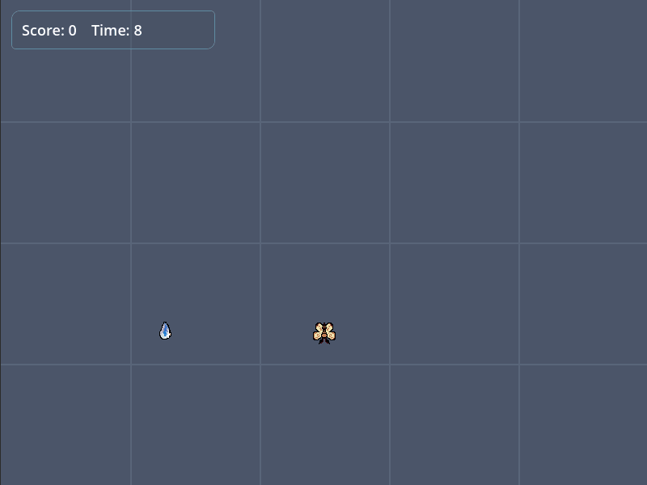

# practice-godot-coin-collect

<p align="center">
  
</p>

플레이어가 아이템을 모으고 시간 내 점수를 쌓는 간단한 게임.

## 프로젝트 목표
Godot 엔진의 기본 구조(Scene, Node, Signal)와 GDScript 문법을 익히기 위해 진행한 첫 연습 프로젝트.

## 진행 기간
2026-06-16 ~ 2026-06-24 (9일)

## 주요 구조

```
main.tscn (main.gd) - 점수/타이머/코인 스폰 관리
├─ Player (player.tscn) - 이동, 회전, 화면 경계 제한
├─ Coin (coin.tscn)     - Area2D 충돌 시 collected 신호
└─ HUD (hud.tscn)       - 점수/시간 표시, 게임오버 안내
```

## 회고
- Godot 4.7로 만든 첫 연습 프로젝트. 
- C 계열 언어 경험 위주였기 때문에 GDScript의 들여쓰기 기반 문법과 signal 중심 이벤트 구조에 적응하는 과정이 필요했다.
- 다음 프로젝트는 튜토리얼 의존도를 줄이고, AI와 함께 작은 프로젝트를 완성하는 것을 목표로 한다.